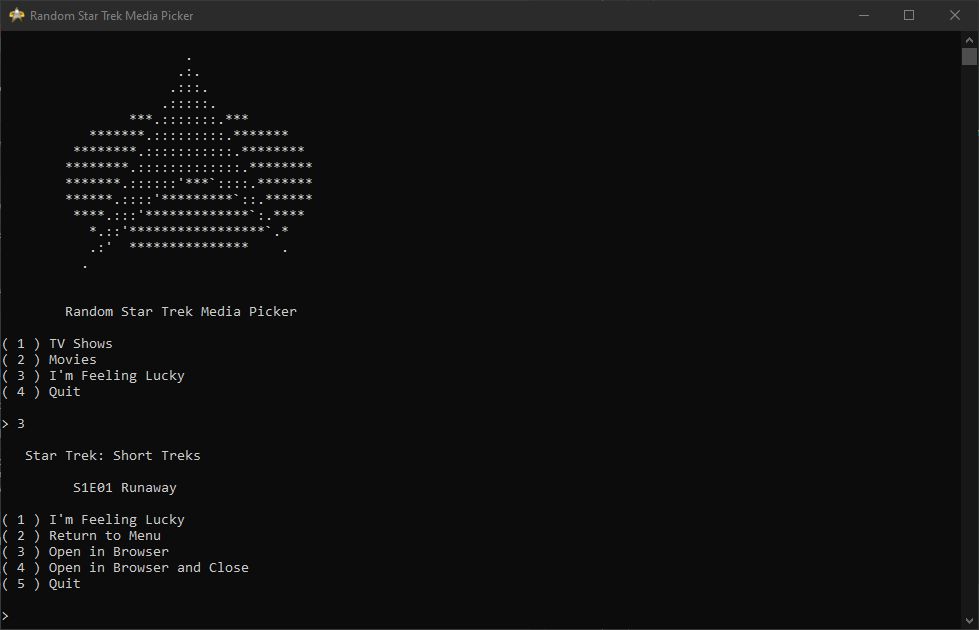

 
 
  
  
 
 # Random Star Trek Media Picker

 **Too** much **Star Trek**, **too** little **time**? 
  
  
 Don't know what to pick? Then this is the program for you! 
  
  
  
 This Python program will randomly pick from any Official Star Trek Movie or TV Show.
  
  
  
 Simply pick a type of ***media*** then pick a ***show*** or ***movie***
 
 **OR**
 
 Pick ***I'm Feeling Lucky*** to get anything!
  
  

## Example:

## Attributions:
Based on the randomizer that currently exists on [people.duke.edu](http://people.duke.edu/~noor/trek.html) (written in JS)
 
ASCII art of the TNG Communicator Pin was taken from [sunnyspot.org](https://sunnyspot.org/asciiart/gallery/startrek.html)
 
 
 
 
Last Updated: <strong id="date">May 18, 2026</strong>

